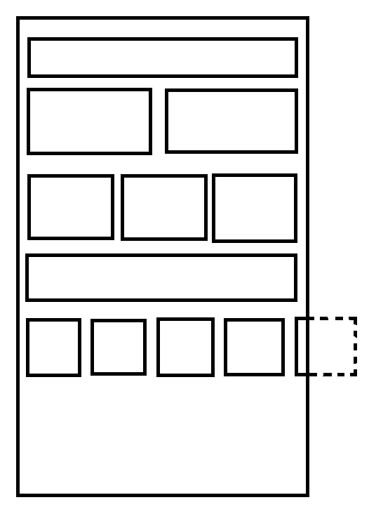

# 简介
计算 RecyclerView（简称 rv） 的每个 child 的曝光时间，比如第一个 child 开始显示在屏幕上，停留 2s 后往下滚动，再往上滚动让第一个 child 重新显示出来，1s 后关掉页面，那么第一个 child 的曝光时间是 3s

# 使用方法
0. 初始化库，调用 RvShowTimeManager.setApplication
1. 需要曝光功能的 rv 使用 addOnScrollListener 添加 RvShowTimeScrollListener，不同情境下的 rv 使用不同的构造方法，详见该类的构造注释
2. rv 所属的 Activity/Fragment 实现 RvShowTimeInterface 接口，在界面 pause 时，会回调相关方法，将曝光数据传给接口
3. 内部 rv 中有个 item 是单独的 rv，比如垂直的 rv 中有个 item 是水平滑动的 rv，该 rv 对应的数据类需要实现 RvShowTimeInnerInterface

# 注意
如果你的 rv 是这样的：

请不要简单粗暴的使用 LinearLayoutManager 去实现这种多列的布局，考虑使用 **GridLayoutManager + GridLayoutManager.SpanSizeLookup**，这样才能精确的得到曝光数据。
